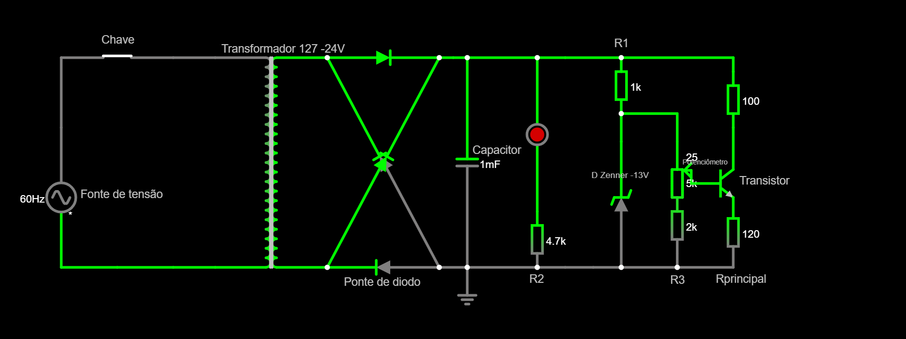
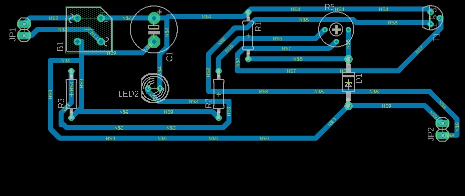
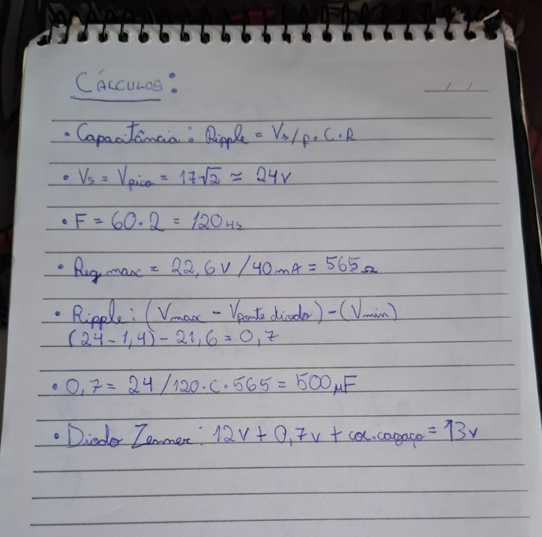

# Fonte de Tensão Ajustável (3V - 12V):

# Objetivo do Projeto:

O objetivo principal deste trabalho é desenvolver uma fonte de alimentação ajustável, montada em protoboard, capaz de converter a corrente alternada (AC) proveniente da rede elétrica doméstica — com tensão média de 127V — em corrente contínua (DC), com tensão ajustável entre 3V e 12V, sendo 12V o valor máximo.

A proposta inclui não apenas a conversão de AC para DC, mas também a regulação e estabilização da tensão de saída, garantindo que a corrente fornecida aos dispositivos conectados seja segura e adequada. Para isso, o circuito incorpora componentes como transformador, ponte retificadora, capacitor, diodo Zener, transistor, potenciômetro e resistores, cada um com funções específicas no controle e na qualidade da tensão final.

 

| Componentes | Quantidade | Valor unitário (R$) |
|:-----|:--------:|------:|
| Resistor 4K7 | 10 | 0,07 |
| Resistor 1K | 10 | 0,07 |
| Resistor 120R | 10 | 0,07 |
| Resistor 100R | 10 | 0,07 |
| Potenciômetro 1W B20K | 1 | 7,00 |
| Capacitor Elco 1000UFX25V | 1 | 1,80|
| Transistor NPN | 1 | 2,60 |
| Diodo Zener 13V 1/2W | 1 | 0,40 |
| Ponte Retificadora | 1 | 3,90 |
| LED | 1 | 0,40 |

 
 

# Descrição e função dos componentes da Fonte Ajustável no Protoboard:

Resistor:
Os resistores têm a função de limitar a corrente elétrica no circuito, protegendo os demais componentes contra sobrecorrentes que possam danificá-los permanentemente. Eles ajudam a manter o funcionamento seguro e estável do sistema.

Diodo Zener:
O diodo Zener atua como um regulador de tensão. Ele permite a condução de corrente apenas quando a tensão estiver abaixo de seu valor nominal, protegendo o circuito contra sobretensões. Neste projeto, o Zener limita a tensão a no máximo 13V.

Capacitor:
O capacitor tem a função de suavizar as variações da tensão (ripple), armazenando carga durante os picos da corrente alternada e liberando-a nos vales. Isso garante uma tensão de saída mais estável e contínua.

Transformador:
O transformador reduz a tensão da rede elétrica (127V) para um valor mais seguro e adequado ao circuito, neste caso, para cerca de 24V. Ele realiza essa conversão sem alterar a frequência ou a forma da corrente (alterna), e sua função é puramente de adequação da tensão.

Potenciômetro:
O potenciômetro permite ajustar a resistência do circuito de forma manual, o que, por consequência, regula a tensão de saída da fonte. No projeto, ele permite variações entre 3V e 12V.

Transistor:
O transistor funciona como um amplificador de corrente ou um comutador. Neste circuito, ele é usado para conduzir a corrente para a carga sem sobrecarregar o diodo Zener, que suporta apenas pequenas correntes (cerca de 10mA). Para operar, o transistor precisa de uma tensão de base mínima de 0,7V.

Ponte Retificadora (Ponte de Diodos):
A ponte de diodos converte a corrente alternada (AC) proveniente do transformador em corrente contínua (DC), mesmo com a inversão periódica do ciclo da AC. Esse processo de retificação gera uma queda de tensão de aproximadamente 1,4V (0,7V por diodo em cada ciclo), resultando em uma tensão de saída de cerca de 22,6V a partir dos 24V iniciais do transformador.
 
 

# Projeto:
foto
 
 

# Fonte Ajustável no Simulador:

Link para o Falstad: https://tinyurl.com/26hy6e8r
 
 

# PCB da Fonte:

 
 

# Cálculos:

 
 

# Vídeo do Projeto:
vídeo
 
 

# Arma de Água com Arduino e Sensor de Presença

# Objetivo do projeto

O objetivo do trabalho era utilizar um sensor ultrassônico para detectar a presença de um alvo. A partir disso, realizar o disparo utilizando uma Bomba de Água imersa dentro do recipiente.

 

| Componentes | Quantidade | Valor unitário (R$) |
|:-----|:--------:|------:|
| Fonte de Tensão Ajustável | 1 | Valor Descrito Acima |
| Resistor 2,2K | 1 | 0,07 |
| Transistor NPN | 1 | 2,60 |
| Relé 5V | 1 | 5,7 |
| Diodo | 2 | 0,7 |
| Placa Arduino Uno | 1 | 52,40 |

# Projeto

 

# Vídeo do Projeto

# Alunos:

Guilherme Pego dos Santos - 15575570
 
Gustavo Vieira Gomes - 16907251
 
Mateus Juares Felipe - 16891602
 
André Luiz Sousa Paião - 16854281
